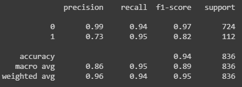

# Spam SMS detection using BERT
## Overview:
This repository implements a spam SMS classifier using the BERT model. It starts by loading SMS data and preprocessing it into training, validation, and test sets. BERT, a pre-trained transformer-based model, is employed for natural language understanding. The SMS text is tokenized and encoded, and the model architecture, consisting of BERT layers followed by fully connected layers, is defined. The training loop utilizes an AdamW optimizer and class weights to handle imbalanced data. Once the model is trained it is deployed through Flask to host a website where when the user inputs the SMS.txt with all the SMS, the output is classified as either spam or genuine.

## Here's what it looks like:

## More about BERT:
It stands out as the first NLP technique that exclusively relies on a self-attention mechanism, made possible by the bidirectional Transformers at the core of its design. This is noteworthy because the meaning of a word can often change as a sentence unfolds. With each added word, the overall significance of the focused word is enhanced by the NLP algorithm. The presence of more words in a sentence or phrase increases the ambiguity of the focus word. BERT addresses this by reading bidirectionally, taking into account the impact of all other words in a sentence on the focus word. It eliminates the left-to-right bias that words may develop towards a specific meaning as the sentence progresses.

### Here's the model's performance:

